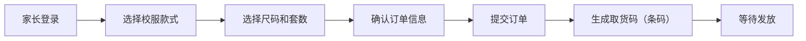
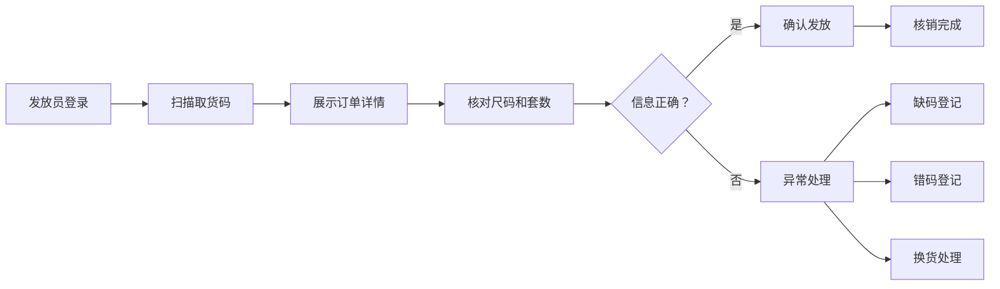
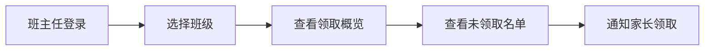

## 1. 产品概述

校服订单条码核销平台，实现校服从下单、核销到统计的全流程管理。家长在线下单后获取取货码，学校或供应商发放时扫码确认尺码、套数及是否换货；缺码或错码进入人工登记流程。班主任可查看本班未领取名单，财务人员可查看订单金额汇总统计。

## 2. 核心功能

### 2.1 用户角色

| 角色 | 登录方式 | 核心权限 |
|------|----------|----------|
| 家长 | 手机号登录 | 下单校服、查看订单、获取取货码 |
| 发放员（学校/供应商） | 账号密码登录 | 扫码核销、确认尺码/套数、换货登记、缺码/错码登记 |
| 班主任 | 账号密码登录 | 查看本班学生列表、未领取名单、领取状态统计 |
| 财务人员 | 账号密码登录 | 查看订单金额汇总、按维度统计报表、导出数据 |
| 管理员 | 账号密码登录 | 用户管理、基础数据配置、全量数据查看 |

### 2.2 功能模块

1. **登录页**：角色选择登录、手机号/账号密码认证
2. **家长端首页**：校服商品展示、下单表单、订单列表、取货码展示
3. **扫码核销页**：条码扫描、订单详情展示、核销确认、尺码/套数校验
4. **异常处理页**：缺码登记、错码登记、换货处理
5. **班主任视图**：班级列表、未领取名单、领取状态统计
6. **财务视图**：金额汇总、多维度统计报表、数据导出
7. **订单管理**：订单列表、订单详情、状态追踪

### 2.3 页面详情

| 页面名称 | 模块名称 | 功能描述 |
|----------|----------|----------|
| 登录页 | 角色选择 | 选择登录角色（家长/发放员/班主任/财务/管理员） |
| 登录页 | 认证模块 | 手机号验证码登录（家长）、账号密码登录（其他角色） |
| 家长首页 | 商品展示 | 展示校服款式、价格、尺码表 |
| 家长首页 | 下单模块 | 选择尺码、套数，提交订单生成取货码 |
| 家长首页 | 订单列表 | 查看历史订单、订单状态、取货码 |
| 扫码核销页 | 扫描模块 | 摄像头扫码、手动输入取货码 |
| 扫码核销页 | 订单详情 | 展示学生信息、尺码、套数、订单金额 |
| 扫码核销页 | 核销确认 | 确认发放、选择是否换货 |
| 异常处理页 | 缺码登记 | 登记缺码信息、备注原因 |
| 异常处理页 | 错码登记 | 记录错发尺码、待处理状态 |
| 异常处理页 | 换货处理 | 原尺码退回、新尺码发放 |
| 班主任视图 | 班级概览 | 班级领取率、未领取人数统计 |
| 班主任视图 | 未领取名单 | 展示未领取学生、支持搜索筛选 |
| 财务视图 | 金额汇总 | 总金额、已收款、待收款统计 |
| 财务视图 | 统计报表 | 按班级、年级、时间维度统计 |
| 财务视图 | 数据导出 | 导出 Excel 报表 |

## 3. 核心流程

### 3.1 家长下单流程

### 3.2 扫码核销流程

### 3.3 班主任查看流程

## 4. 用户界面设计

### 4.1 设计风格

- **主色调**：藏蓝色 (#1e3a5f) - 代表学校的稳重和专业
- **辅助色**：天蓝色 (#3b82f6) - 代表活力、科技感
- **强调色**：橙色 (#f97316) - 用于按钮、重要提示
- **中性色**：白色、浅灰、深灰 - 用于背景和文字
- **按钮风格**：圆角矩形，悬停有阴影和颜色渐变效果
- **字体**：标题使用 Noto Sans SC Bold，正文使用 Noto Sans SC Regular
- **布局风格**：卡片式布局，清晰的信息层级，顶部导航栏
- **图标风格**：使用 lucide-react 图标库，线性风格，统一尺寸

### 4.2 页面设计概述

| 页面名称 | 模块名称 | UI 元素 |
|----------|----------|----------|
| 登录页 | 角色选择 | 卡片式角色选择器、图标+文字、选中态高亮 |
| 登录页 | 登录表单 | 输入框带图标、验证码按钮、登录按钮动效 |
| 家长首页 | 商品展示 | 商品卡片网格、悬停放大效果、价格标签 |
| 家长首页 | 取货码展示 | 大尺寸条码、复制按钮、下载按钮 |
| 扫码核销页 | 扫描区域 | 摄像头取景框、扫描动画、手动输入入口 |
| 扫码核销页 | 订单卡片 | 学生头像、信息标签、状态徽章 |
| 异常处理页 | 表单区域 | 下拉选择、文本域、提交按钮 |
| 班主任视图 | 统计卡片 | 数字动效、图标、颜色区分状态 |
| 班主任视图 | 名单表格 | 斑马纹、悬停高亮、搜索筛选栏 |
| 财务视图 | 数据图表 | 柱状图、饼图、趋势折线图 |

### 4.3 响应式设计

- **桌面优先**：主要面向 PC 端使用（发放员、班主任、财务）
- **移动端适配**：家长端重点优化移动端体验
- **触控优化**：按钮最小尺寸 44x44px，确保触控准确
- **扫码页**：全屏扫描区域，支持横屏模式

### 4.4 交互与动画

- **页面加载**：骨架屏 + 渐入动画
- **扫码成功**：绿色对勾动画 + 轻微震动反馈
- **按钮点击**：缩放反馈 + 波纹效果
- **状态变化**：平滑过渡动画
- **数据更新**：数字滚动动效
- **错误提示**：红色边框 + 抖动动画
