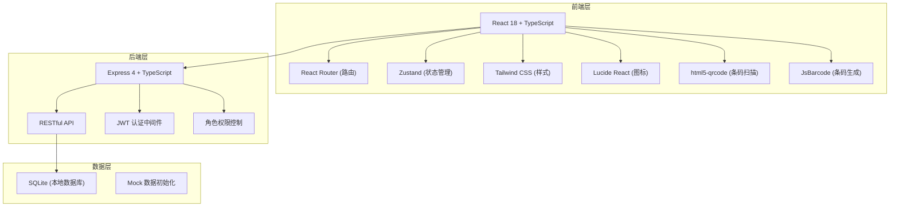
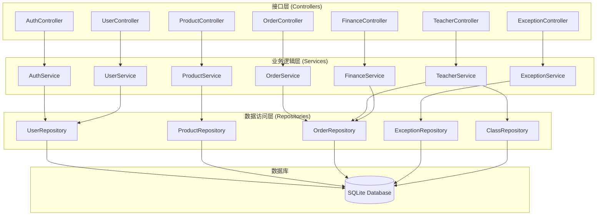
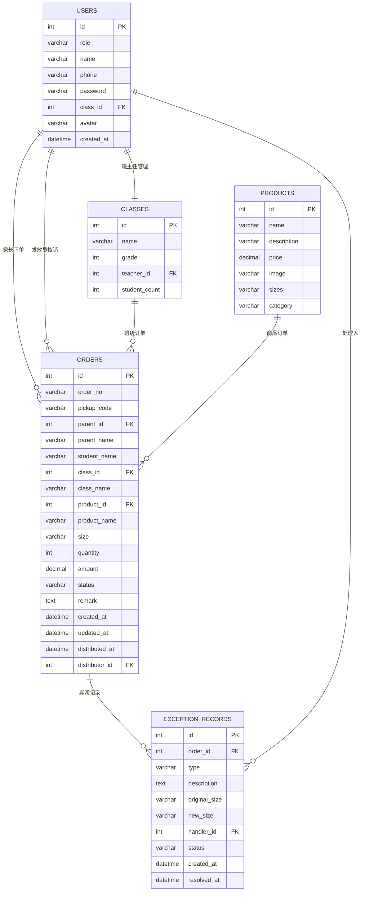

## 1. 架构设计



## 2. 技术描述

- **前端**：React@18 + TypeScript + Vite
- **样式**：Tailwind CSS@3
- **路由**：React Router DOM@6
- **状态管理**：Zustand
- **后端**：Express@4 + TypeScript
- **数据库**：SQLite（使用 better-sqlite3）
- **条码扫描**：html5-qrcode
- **条码生成**：JsBarcode
- **HTTP 客户端**：Axios
- **图标**：lucide-react
- **数据可视化**：recharts
- **初始化工具**：vite-init

## 3. 路由定义

| 路由 | 页面 | 角色权限 |
|------|------|----------|
| /login | 登录页 | 公开 |
| /parent | 家长首页 | 家长 |
| /parent/order | 下单页 | 家长 |
| /parent/orders | 订单列表 | 家长 |
| /parent/pickup/:orderId | 取货码展示 | 家长 |
| /scan | 扫码核销页 | 发放员、管理员 |
| /scan/verify | 核销确认页 | 发放员、管理员 |
| /exception | 异常处理页 | 发放员、管理员 |
| /teacher | 班主任首页 | 班主任 |
| /teacher/class/:classId | 班级详情 | 班主任 |
| /teacher/uncollected | 未领取名单 | 班主任 |
| /finance | 财务首页 | 财务人员、管理员 |
| /finance/reports | 统计报表 | 财务人员、管理员 |
| /admin | 管理后台 | 管理员 |
| /admin/users | 用户管理 | 管理员 |

## 4. API 定义

### 4.1 类型定义

```typescript
// 角色类型
type UserRole = 'parent' | 'distributor' | 'teacher' | 'finance' | 'admin';

// 订单状态
type OrderStatus = 'pending' | 'paid' | 'distributed' | 'exchanged' | 'cancelled';

// 异常类型
type ExceptionType = 'out_of_stock' | 'wrong_size' | 'exchange';

// 用户信息
interface User {
  id: number;
  role: UserRole;
  name: string;
  phone: string;
  classId?: number;
  className?: string;
  avatar?: string;
}

// 校服商品
interface Product {
  id: number;
  name: string;
  description: string;
  price: number;
  image: string;
  sizes: string[];
  category: 'summer' | 'winter' | 'sport';
}

// 订单
interface Order {
  id: number;
  orderNo: string;
  pickupCode: string;
  parentId: number;
  parentName: string;
  studentName: string;
  classId: number;
  className: string;
  productId: number;
  productName: string;
  size: string;
  quantity: number;
  amount: number;
  status: OrderStatus;
  remark?: string;
  createdAt: string;
  updatedAt: string;
  distributedAt?: string;
  distributorId?: number;
}

// 异常记录
interface ExceptionRecord {
  id: number;
  orderId: number;
  type: ExceptionType;
  description: string;
  originalSize?: string;
  newSize?: string;
  handlerId: number;
  status: 'pending' | 'resolved';
  createdAt: string;
  resolvedAt?: string;
}

// 班级
interface Class {
  id: number;
  name: string;
  grade: number;
  teacherId: number;
  studentCount: number;
}
```

### 4.2 接口列表

```typescript
// 认证接口
POST /api/auth/login           // 登录
POST /api/auth/send-sms        // 发送验证码
POST /api/auth/logout          // 登出

// 用户接口
GET  /api/users/me             // 获取当前用户信息
GET  /api/users                // 获取用户列表（管理员）
POST /api/users                // 创建用户（管理员）
PUT  /api/users/:id            // 更新用户（管理员）

// 商品接口
GET  /api/products             // 获取商品列表
GET  /api/products/:id         // 获取商品详情

// 订单接口
POST /api/orders               // 创建订单
GET  /api/orders               // 获取订单列表（按角色过滤）
GET  /api/orders/:id           // 获取订单详情
GET  /api/orders/pickup/:code  // 通过取货码获取订单
PUT  /api/orders/:id/verify    // 核销订单
PUT  /api/orders/:id/exchange  // 换货处理

// 异常处理接口
POST /api/exceptions           // 创建异常记录
GET  /api/exceptions           // 获取异常列表
PUT  /api/exceptions/:id/resolve // 解决异常

// 班主任接口
GET  /api/teacher/classes      // 获取班主任管理的班级
GET  /api/teacher/class/:id/stats // 获取班级统计
GET  /api/teacher/class/:id/uncollected // 获取未领取名单

// 财务接口
GET  /api/finance/summary      // 获取金额汇总
GET  /api/finance/reports      // 获取统计报表数据
GET  /api/finance/export       // 导出报表

// 班级接口
GET  /api/classes              // 获取班级列表
```

## 5. 服务器架构图



## 6. 数据模型

### 6.1 ER 图



### 6.2 DDL 语句

```sql
-- 用户表
CREATE TABLE users (
    id INTEGER PRIMARY KEY AUTOINCREMENT,
    role VARCHAR(20) NOT NULL CHECK (role IN ('parent', 'distributor', 'teacher', 'finance', 'admin')),
    name VARCHAR(100) NOT NULL,
    phone VARCHAR(20) NOT NULL UNIQUE,
    password VARCHAR(255),
    class_id INTEGER,
    avatar VARCHAR(255),
    created_at DATETIME DEFAULT CURRENT_TIMESTAMP,
    FOREIGN KEY (class_id) REFERENCES classes(id)
);

-- 班级表
CREATE TABLE classes (
    id INTEGER PRIMARY KEY AUTOINCREMENT,
    name VARCHAR(50) NOT NULL,
    grade INTEGER NOT NULL,
    teacher_id INTEGER,
    student_count INTEGER DEFAULT 0,
    FOREIGN KEY (teacher_id) REFERENCES users(id)
);

-- 商品表
CREATE TABLE products (
    id INTEGER PRIMARY KEY AUTOINCREMENT,
    name VARCHAR(100) NOT NULL,
    description TEXT,
    price DECIMAL(10,2) NOT NULL,
    image VARCHAR(255),
    sizes TEXT NOT NULL,
    category VARCHAR(20) NOT NULL CHECK (category IN ('summer', 'winter', 'sport'))
);

-- 订单表
CREATE TABLE orders (
    id INTEGER PRIMARY KEY AUTOINCREMENT,
    order_no VARCHAR(32) NOT NULL UNIQUE,
    pickup_code VARCHAR(20) NOT NULL UNIQUE,
    parent_id INTEGER NOT NULL,
    parent_name VARCHAR(100) NOT NULL,
    student_name VARCHAR(100) NOT NULL,
    class_id INTEGER NOT NULL,
    class_name VARCHAR(50) NOT NULL,
    product_id INTEGER NOT NULL,
    product_name VARCHAR(100) NOT NULL,
    size VARCHAR(20) NOT NULL,
    quantity INTEGER NOT NULL DEFAULT 1,
    amount DECIMAL(10,2) NOT NULL,
    status VARCHAR(20) NOT NULL DEFAULT 'pending' CHECK (status IN ('pending', 'paid', 'distributed', 'exchanged', 'cancelled')),
    remark TEXT,
    created_at DATETIME DEFAULT CURRENT_TIMESTAMP,
    updated_at DATETIME DEFAULT CURRENT_TIMESTAMP,
    distributed_at DATETIME,
    distributor_id INTEGER,
    FOREIGN KEY (parent_id) REFERENCES users(id),
    FOREIGN KEY (class_id) REFERENCES classes(id),
    FOREIGN KEY (product_id) REFERENCES products(id),
    FOREIGN KEY (distributor_id) REFERENCES users(id)
);

-- 异常记录表
CREATE TABLE exception_records (
    id INTEGER PRIMARY KEY AUTOINCREMENT,
    order_id INTEGER NOT NULL,
    type VARCHAR(20) NOT NULL CHECK (type IN ('out_of_stock', 'wrong_size', 'exchange')),
    description TEXT,
    original_size VARCHAR(20),
    new_size VARCHAR(20),
    handler_id INTEGER NOT NULL,
    status VARCHAR(20) NOT NULL DEFAULT 'pending' CHECK (status IN ('pending', 'resolved')),
    created_at DATETIME DEFAULT CURRENT_TIMESTAMP,
    resolved_at DATETIME,
    FOREIGN KEY (order_id) REFERENCES orders(id),
    FOREIGN KEY (handler_id) REFERENCES users(id)
);

-- 索引
CREATE INDEX idx_orders_pickup_code ON orders(pickup_code);
CREATE INDEX idx_orders_parent_id ON orders(parent_id);
CREATE INDEX idx_orders_class_id ON orders(class_id);
CREATE INDEX idx_orders_status ON orders(status);
CREATE INDEX idx_exceptions_order_id ON exception_records(order_id);
CREATE INDEX idx_exceptions_status ON exception_records(status);
```

### 6.3 初始化 Mock 数据

```sql
-- 班级数据
INSERT INTO classes (name, grade, student_count) VALUES 
('一年级1班', 1, 45),
('一年级2班', 1, 42),
('二年级1班', 2, 48),
('二年级2班', 2, 46),
('三年级1班', 3, 50);

-- 用户数据
INSERT INTO users (role, name, phone, password, class_id) VALUES 
('admin', '系统管理员', '13800000000', 'admin123', NULL),
('distributor', '张发放', '13800000001', '123456', NULL),
('distributor', '李发放', '13800000002', '123456', NULL),
('teacher', '王老师', '13800000003', '123456', 1),
('teacher', '赵老师', '13800000004', '123456', 2),
('finance', '刘财务', '13800000005', '123456', NULL),
('parent', '陈家长', '13800000006', NULL, 1),
('parent', '周家长', '13800000007', NULL, 1),
('parent', '吴家长', '13800000008', NULL, 2),
('parent', '郑家长', '13800000009', NULL, 2);

-- 商品数据
INSERT INTO products (name, description, price, image, sizes, category) VALUES 
('夏季校服套装', '短袖上衣+短裤，透气舒适', 180.00, 'summer1.jpg', '110,120,130,140,150,160,170', 'summer'),
('冬季校服套装', '长袖上衣+长裤，保暖加厚', 280.00, 'winter1.jpg', '110,120,130,140,150,160,170', 'winter'),
('运动校服套装', '运动上衣+运动裤，轻便舒适', 220.00, 'sport1.jpg', '110,120,130,140,150,160,170', 'sport');

-- 订单数据
INSERT INTO orders (order_no, pickup_code, parent_id, parent_name, student_name, class_id, class_name, product_id, product_name, size, quantity, amount, status) VALUES 
('202406010001', 'XF000001', 7, '陈家长', '小明', 1, '一年级1班', 1, '夏季校服套装', '130', 2, 360.00, 'paid'),
('202406010002', 'XF000002', 7, '陈家长', '小明', 1, '一年级1班', 2, '冬季校服套装', '130', 1, 280.00, 'distributed'),
('202406010003', 'XF000003', 8, '周家长', '小红', 1, '一年级1班', 1, '夏季校服套装', '120', 1, 180.00, 'paid'),
('202406010004', 'XF000004', 8, '周家长', '小红', 1, '一年级1班', 3, '运动校服套装', '120', 1, 220.00, 'pending'),
('202406010005', 'XF000005', 9, '吴家长', '小刚', 2, '一年级2班', 1, '夏季校服套装', '140', 2, 360.00, 'distributed'),
('202406010006', 'XF000006', 10, '郑家长', '小美', 2, '一年级2班', 2, '冬季校服套装', '110', 1, 280.00, 'paid');
```
